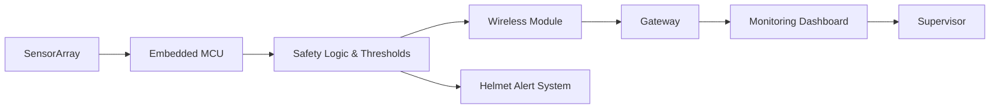

<!-- AUTO-GENERAT### 🧭 Mission

Craft reliable, insight-rich embedded and architectural sol### 🧩 Philosophy

> "Engineering reliability isn't an afterthought—it's the architecture of attention to detail."

### ♿ Accessibility & Reliability Notes

- **Reproducible CI**: Automated metrics updates ensure consistent data freshness
- **Structured metrics**: JSON output enables programmatic access and validation  
- **Deterministic builds**: Version-pinned dependencies and explicit tool chains
- **Fail-safe design**: Graceful degradation when external APIs are unavailable

### 🤝 Connect

Email • LinkedIn • Portfolio (links above)s—bridging silicon-level constraints with user-facing impact, focusing on safety, measurement, and maintainability.

### 👨‍💻 About

I'm a 4th-year Computer Engineering student at University of Peradeniya, specializing in embedded systems and RISC-V pipeline design. My focus areas include:

- RISC-V pipelines, timing & verification
- Sensor-integrated embedded safety systems  
- Safety-oriented hardware/software co-design
- Structured debugging + performance profiling
- Fast prototyping full-stack tools to visualize hardware data

| Focus 2025 Goals | Progress |
|------------------|----------|
| Release reusable safety/telemetry embedded module | ⏳ In design |
| Publish RISC-V pipeline performance breakdown | 📝 Drafting |
| Improve formal verification coverage % | 🔧 Iterating |
| Complete safety-critical system certification study | 📚 Planning |trics + Activity injected by GitHub Actions -->
<h1 align="center">Hi 👋, I'm Ravindu</h1>

  <strong>4th-Year Computer Engineering Student • RISC-V Pipeline Design • Safety-Oriented Hardware/Software Co-Design</strong>

  
  
  
  
  
  

---

### 🧭 Mission
Craft reliable, insight-rich embedded and architectural solutions—bridging silicon-level constraints with user-facing impact, focusing on safety, measurement, and maintainability.

### 👨‍💻 About
I’m a 4th-year Computer Engineering student (University of Peradeniya). Passionate about:
- RISC-V pipelines, timing & verification
- Sensor-integrated embedded safety systems
- Structured debugging + performance profiling
- Fast prototyping full-stack tools to visualize hardware data

| Focus 2025 | Progress |
|------------|----------|
| Release reusable safety/telemetry embedded module | ⏳ In design |
| Publish RISC-V pipeline performance breakdown | 📝 Drafting |
| Improve formal verification coverage % | 🔧 Iterating |

### 🛠 Tech Landscape

<!--TECH-STACK-START-->

  

<strong>Specializing in:</strong> RISC-V Architecture, Embedded Safety Systems, Hardware/Software Co-Design, Formal Verification

<!--TECH-STACK-END-->

### 🚀 Projects Snapshot
| Project | Scope | Impact / Focus | Tech |
|---------|-------|----------------|------|
| Safe Plus – Smart Safety Helmet | Industrial Safety | Real-time hazard detection + alert pipeline | Embedded, Sensors, Wireless |
| Denture Design Studio | EdTech UX | Guided procedural training + validation | Web Platform, React (if used) |
| RV32IM Pipeline (Group 2) | CPU Design | 5-stage pipeline + testbench verification | Verilog, RISC-V Arch |

### 🧪 Architecture Diagram (Conceptual Safety Telemetry Flow)

### 📊 Metrics
<!--METRICS-START-->
(Loading dynamic metrics...)
<!--METRICS-END-->

### 🔄 Recent Activity
<!--ACTIVITY-START-->
(Recent events will appear here)
<!--ACTIVITY-END-->

### ✍️ Latest Articles / Notes
<!--BLOG-START-->
(No posts yet)
<!--BLOG-END-->

### 🧩 Philosophy
> “Engineering reliability isn’t an afterthought—it’s the architecture of attention to detail.”

### 🤝 Connect
Email • LinkedIn • Portfolio (links above)

---

  <!--TIMESTAMP-->Last auto update: (pending)

