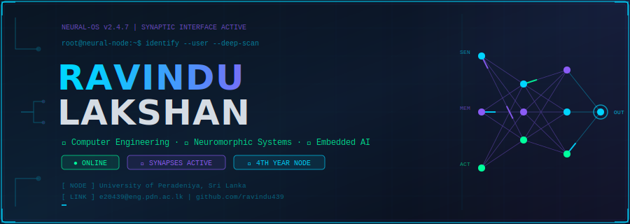
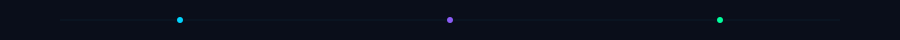
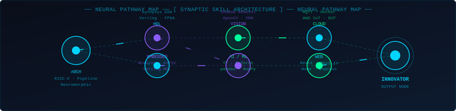

<div align="center">
  
</div>

<div align="center">
  
</div>

<div align="center">

&nbsp;
&nbsp;
&nbsp;
&nbsp;


</div>



```
root@ravindu:~$ whoami

╔══════════════════════════════════════════════════════════════════════╗
║  Name      : Ravindu Lakshan                                         ║
║  University: University of Peradeniya, Sri Lanka                     ║
║  Degree    : B.Sc. Engineering (Hons.) — Computer Engineering        ║
║  Interests : Neuromorphic Computing · Computer Architecture · AI     ║
║  Also into : Embedded Systems · Computer Vision · Web Development    ║
║  Now       : Final year, building things that push boundaries        ║
╚══════════════════════════════════════════════════════════════════════╝
```


## `⬡ Skills & Technologies`

<div align="center">
  
</div>

<div align="center">

| Area | Tools & Technologies |
|:---|:---|
| `⬡ Architecture` | C/C++, RISC-V, Computer Architecture, Neuromorphic Computing, Synopsys EDA |
| `⬡ Embedded` | Arduino, ESP32, MQTT, AWS IoT, Embedded Systems |
| `⬡ Hardware (HDL)` | Verilog HDL, FPGA, GTKWave, 5-stage Pipeline Design |
| `⬡ AI / ML` | TensorFlow, PyTorch, pandas, NumPy, Matplotlib, Scikit-learn |
| `⬡ Computer Vision` | OpenCV, CNN, Shadow Removal, Object Detection |
| `⬡ Web & Backend` | JavaScript, Go, React.js, Next.js, Node.js, Express.js, Flask, MongoDB, SQL |
| `⬡ Cloud & DevOps` | Google Cloud Platform, AWS IoT, Docker, Git |

</div>


## `⬡ GitHub Stats`

<div align="center">
  
  &nbsp;
  
</div>

<div align="center">
  
</div>


## `⬡ Contributions`

<div align="center">
  
</div>


## `⬡ Let's Connect`

<div align="center">

[](https://www.linkedin.com/in/ravindu-lakshan-45bb00278/)&nbsp;
[](mailto:e20439@eng.pdn.ac.lk)&nbsp;
[](https://github.com/ravindu439)

```
// Based in Sri Lanka 🇱🇰
// Open to collaborations, research & cool projects
root@ravindu:~$ █
```

</div>

<div align="center">
  <sub><code>© 2025 Ravindu Lakshan · NEURAL-OS v2.4.7 · Built from silicon dreams</code></sub>
</div>
